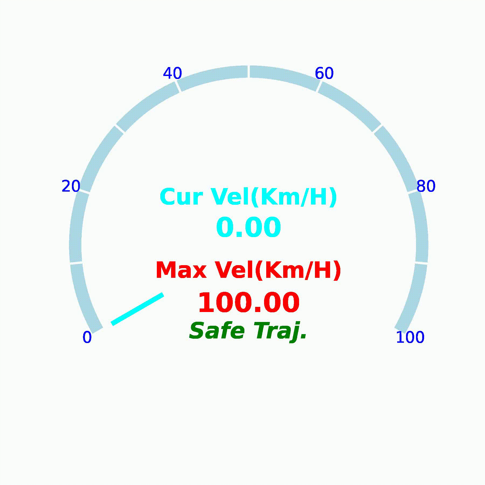

# 🚗 Speedometer Visualization Tool

Dynamically generate speed dashboard animations with transparent background support. Designed for video editing workflows (Premiere Pro, Final Cut Pro, DaVinci Resolve, etc.)

## 🌟 Features
- 🎨 ​**Style Customization** - Adjust colors, scales and display styles
- 🚀 ​**ROS Integration** - Directly subscribe to Odometry topics
- 📊 ​**Data Analysis** - Velocity statistics and trajectory evaluation
- 🎥 ​**Transparent Video** - Export with alpha channel for compositing

## 📸 Demo & Results

  
*Gazebo example*


  
*Real-time Speed Visualization*


##  🚀 Quick Start
1. Modify ROS topic in `odom_subscriber.py`:

    ```
    # Line 15
    self.odom_topic = rospy.get_param('~odom_topic', '/iris_0/mavros/vision_odom/odom')
    ```
2. Record UAV data:
   
    `python3 odom_subscriber.py`

3. Generate visualization:
   
    `python3 SpeedVisualization.py --csv odom_data.csv --output flight.mp4 --fps 30`

4. Create transparent video:
   
   `sh mov_video.sh`
## 📝 TODO

Add velocity smoothing module